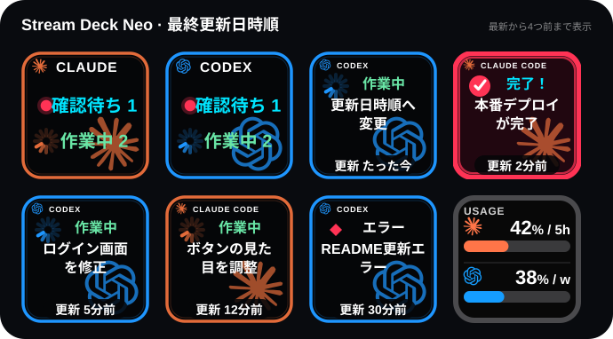
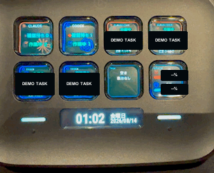
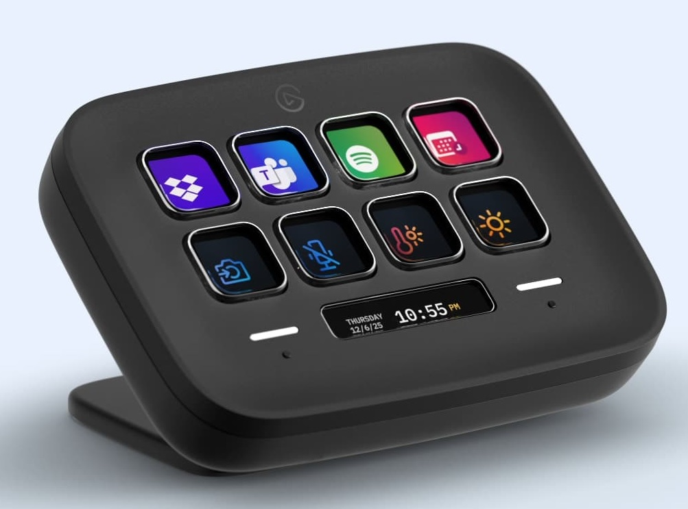

# Claude & Codex Status for Stream Deck Neo

[English](README.md) | 日本語

[](https://github.com/sugasaki/stream-deck-claude-codex-status/tags)
[](LICENSE)

Claude CodeとCodexのタスクセッションをStream Deckへ表示するmacOS向けプラグインです。

エージェントへ指示を送ったあと別の作業へ移っても、返信完了や許可要求を `確認待ち` と実際のセッション名で知らせます。Claude CodeとCodexの複数タスクを一つの画面で見渡し、タスクキーを押して元のアプリへ戻れます。



<p align="center">
  <strong>実機での動作サンプル</strong><br>
  <br>
  <sub>セッション名と利用率は公開用に匿名化しています。</sub>
</p>

## 主な機能

- Claude CodeとCodexの `作業中`、`確認待ち`、`エラー` を表示
- 両エージェントの実タスクを最終更新日時の新しい順に2ページで最大13件表示
- 変更可能なClaude/Codexのチャット名をセッション名として使用
- 確認待ちへ変わった直後の10秒間は赤いマーカーを点滅
- 作業中は大きな回転インジケーターを毎秒5フレームで表示
- タスクキーから起動元アプリを前面表示
- `確認待ち` のタスクキーを0.8秒以上長押しすると完了扱いで一覧から除外
- Claudeの5時間利用率とCodexの週間利用率を1キーに統合
- Stream Deck再起動後も最近のタスク状態を復元

## 必要環境

<p align="center">
  <strong>動作する機材の例：Elgato Stream Deck Neo</strong><br>
  
</p>

| 項目 | 要件 |
| --- | --- |
| OS | macOS 13以降 |
| Stream Deck | Stream Deck 7.1以降 |
| デバイス | Stream Deck Neo向けに最適化 |
| 開発・フック導入 | Node.js 24以降 |
| エージェント | Claude Code、Codexのいずれか、または両方 |

表示は144×144ピクセルのLCDキー向けです。Neo以外のStream DeckでもKeypadアクションとして配置できますが、このリポジトリではNeoの2×4配置を基準にしています。

## インストール

### 1. プラグインをインストール

配布済みの `.streamDeckPlugin` を使う場合は、ファイルをダブルクリックしてStream Deckへインストールします。

ソースから作る場合:

```sh
git clone https://github.com/sugasaki/stream-deck-claude-codex-status.git
cd stream-deck-claude-codex-status
npm install
npm run pack
open dist/com.atsu.claude-code-status.streamDeckPlugin
```

### 2. エージェントのフックを追加

リポジトリのフォルダで実行します。

```sh
npm run hooks:install
npm run codex-hooks:install
```

- Claude Code用設定は `~/.claude/settings.json` へ追加されます。
- Codex用設定は `~/.codex/hooks.json` へ追加されます。
- 既存設定は残し、このプラグイン専用の目印付きエントリだけを追加・更新します。
- 既存ファイルを変更する場合は、同じフォルダへバックアップを作成します。
- 書き込み直前に別プロセスが設定を変更した場合は、上書きせず停止します。

Codexでは `/hooks` を開き、追加されたユーザーフックを信頼してください。これにより実行許可待ちもすぐに反映されます。

### 3. キーを配置

Stream Deckアプリの `Claude & Codex Status` カテゴリーから、次のように配置します。

1ページ目には概要、最新5タスク、利用率を配置します。

| 位置 | アクション | 内容 |
| --- | --- | --- |
| 上段1 | `Claude Code 概要` | Claudeの確認待ち・作業中件数 |
| 上段2 | `Codex 概要` | Codexの確認待ち・作業中件数 |
| 上段3 | `最新更新タスク` | 最新タスク |
| 上段4 | `1つ前の更新タスク` | 2番目に新しいタスク |
| 下段1 | `2つ前の更新タスク` | 3番目に新しいタスク |
| 下段2 | `3つ前の更新タスク` | 4番目に新しいタスク |
| 下段3 | `4つ前の更新タスク` | 5番目に新しいタスク |
| 下段4 | `Claude 5時間 + Codex 週間使用率` | 利用率の統合表示 |

2ページ目には、同じ最終更新日時順の続きを8件配置します。

| 位置 | アクション | 内容 |
| --- | --- | --- |
| 上段1 | `5つ前の更新タスク` | 6番目に新しいタスク |
| 上段2 | `6つ前の更新タスク` | 7番目に新しいタスク |
| 上段3 | `7つ前の更新タスク` | 8番目に新しいタスク |
| 上段4 | `8つ前の更新タスク` | 9番目に新しいタスク |
| 下段1 | `9つ前の更新タスク` | 10番目に新しいタスク |
| 下段2 | `10件前の更新タスク` | 11番目に新しいタスク |
| 下段3 | `11件前の更新タスク` | 12番目に新しいタスク |
| 下段4 | `12件前の更新タスク` | 13番目に新しいタスク |

旧バージョンの `AI Agent Status` は互換用に残していますが、新規アクション一覧には表示されません。配置済みの場合は削除できます。

## 状態の意味

| 表示 | 意味 |
| --- | --- |
| 作業中 | エージェントが応答を生成中、またはツールを実行中 |
| 確認待ち | 返信が完了したか、回答・選択・実行許可が必要 |
| エラー | ツールまたは応答が失敗・中断 |
| 空き / 表示なし | その位置へ表示する実タスクがない |

概要キーはClaudeとCodexを別々に集計します。エラー件数は概要へ含めず、該当するタスクキーだけに表示します。

## タスクの並び方と終了判定

Claude CodeとCodexを合わせ、エージェント側の最終更新日時が新しい順に並べます。確認待ちを作業中より優先するなど、状態による並べ替えはしません。先頭5件を1ページ目、続く8件を2ページ目へ表示します。

タスクキーを短押ししても一覧から消えません。Claude/Codexのメインタスクが終了したとき、Codexのタスクをアーカイブしたとき、8時間以上更新がないとき、または `確認待ち` のタスクキーを0.8秒以上長押ししたときに表示対象から外れます。返信完了後は、ユーザーが実際に戻って確認するか、長押しで完了扱いにするまで `確認待ち` を維持します。エージェントから新しい更新が届けば再び表示します。

## セッション名

### Codex

`~/.codex/session_index.jsonl` にある変更後のタスク名を優先し、名称がなければタスク本体のローカル記録へ戻ります。名称変更だけでは表示順を変えません。

### Claude Code

次の順で利用できる名前を探します。

1. Remote Controlで変更したチャット名
2. ローカル記録にある変更後のセッション名
3. Claudeが生成した名前またはエージェント名
4. 内容を識別できる直近の依頼
5. 最初の実際の依頼

`OK`、`続けて`、ローカルコマンド、画像通知など、セッションを見分けにくい文字列は名前候補から除外します。Remote Controlの名称は約15秒以内に反映します。

## タスクキーを押したとき

タスクキーを短押しすると、そのセッションを開いている可能性が最も高いアプリを前面にします。`確認待ち` のキーを0.8秒以上長押しすると、その返信を完了扱いにしてタスク一覧から外します。作業中のタスクを長押ししても一覧から外しません。

- Claude Code: セッションPIDの親プロセスをたどり、Ghostty、Terminalなど実際の起動元 `.app` を検出
- Codex: セッションに記録された起動元を使用し、対応していればZed、Visual Studio Code、Chromeなどを起動
- Codexデスクトップ: `codex://threads/<task-id>` でChatGPTの該当タスクを直接開く
- 判定・起動に失敗した場合: ClaudeはClaudeアプリ、CodexはChatGPTアプリへフォールバック

概要キーは押しても状態を変更しません。利用率キーは押すと再描画します。

## 利用率

| エージェント | 表示期間 | 主な取得元 | 通信頻度 |
| --- | --- | --- | --- |
| Claude | 5時間 | Anthropic OAuth利用量API | 最短5分 |
| Codex | 週間 | ChatGPT/Codex利用量API | 1分ごと |

Claudeの取得は[CodexBar](https://github.com/steipete/CodexBar)の方式を参考にしています。

- インストール済みClaude Codeのバージョンを検出し、`claude-code/<version>` のUser-Agentを使用
- Stream Deckの描画更新とAnthropic API通信を分離
- HTTP 429を受けた場合は、`Retry-After` または最低5分のクールダウンを適用
- 通信失敗時は直前の成功値を維持
- 成功値がない場合は、Claudeデスクトップが保存した30分以内のローカル利用率へフォールバック
- キーを押してもClaude APIの最短間隔とクールダウンは迂回しない

表示例はClaudeが `42% / 5h`、Codexが `38% / w` です。契約プランやAPIが該当期間を返さない場合は `—`、ログイン情報がない場合は `LOGIN`、利用できる値も予備データもない一時エラーは `ERR` と表示します。

## 仕組み

### 状態イベント

- Claude Codeのライフサイクルフックは、ローカルHTTPサーバー `127.0.0.1:37654` へイベントを送信します。
- Codexはローカルのタスク記録から開始・完了を監視し、ユーザーフックで許可要求を補完します。
- 受信したイベントから、表示に必要なエージェント、状態、短縮したセッション名、時刻だけを保持します。

### ローカル保存

最近の表示状態は次へ保存します。

```text
~/Library/Application Support/Claude-Codex-Status/session-state.json
```

Stream Deck再起動後の表示復元に使用します。8時間以上更新のない状態は自動的に破棄します。

### 外部通信

| 用途 | 接続先 |
| --- | --- |
| Claudeの5時間利用率 | `https://api.anthropic.com/api/oauth/usage` |
| Claude Remote Controlのタイトル | Claude公式 `api.anthropic.com` |
| Codexの週間利用率 | `https://chatgpt.com/backend-api/wham/usage` |

Remote Controlを使っていない場合やネットワークに接続できない場合も、ローカルにあるセッション名と状態監視は動作します。

## プライバシーと認証情報

- 会話本文、プロンプト全文、ファイル内容、ツールの入出力は保存しません。
- セッション名は最大80文字へ短縮し、表示用に最大3行へ分割します。
- 利用率取得では既存のClaude Code/Codexログインを読みますが、トークンを独自ファイルへ保存しません。
- 認証トークン、Cookie、APIレスポンス本文をログへ出しません。
- 状態フックの送信先はlocalhostだけで、外部へ転送しません。
- 外部API通信は利用率とRemote Controlのタイトル取得に限られます。

## トラブルシューティング

### `未接続` と表示される

1. Stream Deckアプリを起動していることを確認します。
2. プラグインを再インストールするか、Stream Deckアプリを再起動します。
3. ローカルサーバーを確認します。

```sh
curl http://127.0.0.1:37654/health
```

`{"ok":true,...}` が返ればプラグインは動作しています。ポート37654を別のアプリが使用していないかも確認してください。

### タスクが表示されない

- `npm run hooks:install` と `npm run codex-hooks:install` を再実行します。
- Codexの `/hooks` でユーザーフックが信頼済みか確認します。
- Claude Code/Codexで新しい依頼を1件送り、ライフサイクルイベントを発生させます。

### セッション名が古い、または依頼文になっている

- Claude/Codex側でチャット名を変更します。
- Claude Remote Control名は反映まで約15秒待ちます。
- Codex名はローカルのセッションインデックス更新後に反映されます。

### 利用率が `ERR`、`LOGIN`、`—` になる

- `ERR`: ネットワークエラーやHTTP 429です。成功値またはローカル値がない場合だけ表示されます。5分以上待って再確認します。
- `LOGIN`: 対象CLIへログインし直します。
- `—`: APIまたは契約プランが該当期間の数値を提供していません。

### タスクキーで目的のアプリが開かない

起動元を特定できないセッションではClaudeアプリまたはChatGPTアプリを開きます。セッションがターミナルやエディターの子プロセスとして動いていない場合、個別ウインドウまでは特定できません。

## アップデート

新しい `.streamDeckPlugin` をダブルクリックして上書きインストールします。ソースから更新する場合:

```sh
git pull
npm install
npm run pack
open dist/com.atsu.claude-code-status.streamDeckPlugin
npm run hooks:install
npm run codex-hooks:install
```

フック導入スクリプトは繰り返し実行しても同じ専用エントリを重複追加しません。

## アンインストール

```sh
npm run hooks:uninstall
npm run codex-hooks:uninstall
```

Stream Deckアプリの設定から `Claude & Codex Status` をアンインストールします。保存状態も不要な場合は、次のフォルダをFinderから削除できます。

```text
~/Library/Application Support/Claude-Codex-Status
```

## 開発

```sh
npm install
npm run check
npm test
npm run build
npm run validate
npm run pack
```

| コマンド | 内容 |
| --- | --- |
| `npm run watch` | 変更を監視してビルドし、プラグインを再起動 |
| `npm run preview` | README用の匿名プレビューを再生成 |
| `npm run demo -- working claude` | Claude作業中のテストイベントを送信 |
| `npm run demo -- attention codex` | Codex確認待ちのテストイベントを送信 |

状態は `ready`、`working`、`attention`、`done`、`error`、`offline`、エージェントは `claude` または `codex` を指定できます。

主な実装:

| ファイル | 役割 |
| --- | --- |
| `src/status.ts` | セッション状態、並べ替え、復元 |
| `src/render.ts` | 概要・タスクキーのSVG描画 |
| `src/codex-task-monitor.ts` | Codexローカルタスク監視 |
| `src/claude-task-name.ts` | Claudeのローカルセッション名解決 |
| `src/claude-remote-title.ts` | Claude Remote Control名の解決 |
| `src/session-app.ts` | タスクから起動元アプリを特定 |
| `src/usage.ts` | Claude/Codex利用率の取得・キャッシュ・バックオフ |
| `src/server.ts` | localhostのフック受信サーバー |

エージェントがこのリポジトリを変更する場合は [`AGENTS.md`](AGENTS.md) の作業規約も参照してください。

## リリースとバージョン

- Gitタグ: `v<major>.<minor>.<patch>`
- npmパッケージ: `<major>.<minor>.<patch>`
- Stream Deck manifest: `<major>.<minor>.<patch>.0`
- 配布物: `dist/com.atsu.claude-code-status.streamDeckPlugin`

リリース前に `npm run pack` を実行し、型チェック、全テスト、ビルド、Stream Deck manifest検証を通します。

## ライセンス

[MIT License](LICENSE)
